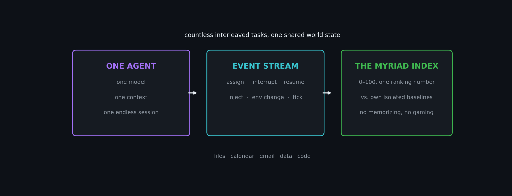

# MyriadBench

<p align="center">
  
</p>

> **One model. One session. All tasks.**
> In the far future, AI converges into a single model: the one entry point to your digital life — one endless session, handling a myriad of interleaved, interrupted, mutually dependent tasks.
> **No benchmark on earth measures this today. MyriadBench is the first.**

Existing benchmarks measure two things only: parallel multi-task (MMLU, HLE — thousands of unrelated questions) and single-task long-horizon (SWE-bench, OSWorld — one goal per session). But once AI is everyone's single entry point, every person's daily reality is **one agent's day**: coding, research, scheduling, email, data — interrupted, preempted, dependent on each other. Task-switching costs are proven (EMNLP 2024), never systematically measured. That gap is MyriadBench.

**Where do models stand?** First readings (DeepSeek-V4-Flash via OpenCode Go, single pilot, seed 7):

| session | K | D | MI | IC |
|---|---|---|---|---|
| a light morning | 4 | 0.6 | **70.0** | 0.00 |
| a crowded day | 8 | 0.0 | **45.4** | 0.99 |
| a crowded day + interruptions | 8 | 0.6 | **18.5** | 1.00 |

Doubling the day from 4 to 8 tasks collapses task retention from 100% to near zero (IC 0.00 → 0.99); adding interruptions halves the index again. This is one model; the fleet is coming.

**The Myriad Index (MI)** is the single ranking key, 0–100. **Every model in the world runs the exact same official suite** — fixed tasks, fixed process, directly comparable scores. The full score is unreachable by design: even a perfect agent scores ~97 because mixing costs tokens. The higher the MI, the stronger the model, by world-recognizable definition — every component is anchored to the model's *own* isolated baseline, so you cannot memorize your way up. If a model ever approaches 95+, that means it genuinely earned it; the response is a new frozen suite (harder tasks, same everyone-runs-the-same-suite property, old suites stay runnable forever) — the MMLU → MMLU-Pro pattern, never different models on different tasks.

## Quick Start

```bash
# 0. Python 3.10+, zero dependencies
cd myriad-bench

# 1. Generate a mixture (session + per-task isolated baselines, same seed → reproducible)
python -m harness.cli generate --out data/generated --mix-id demo --seed 7 \
    --K 8 --H 0.6 --D 0.5 --DEP 0.4 --IR 0.3 --NV 0.2 --tier S

# 2. Run any OpenAI-compatible model (key: MYRIAD_API_KEY)
python -m harness.cli run --session data/generated/sessions/demo-s7.json \
    --agent openai --model gpt-4o-mini --out data/results \
    --with-isolated data/generated/isolated

# 3. Report: MI + full decomposition
python -m harness.cli report --session data/generated/sessions/demo-s7.json \
    --trace data/results/demo-s7-openai.json \
    --isolated data/results/isolated --out data/results
```

No key? `--agent echo` runs the whole flow for free.
Self-check: `python -m unittest discover -s tests` (32 tests).

## How it works (30 seconds)

<p align="center">
  
</p>

One session = one agent + one event stream (`assign` / `interrupt` / `resume` / `inject` / `env_change` / `tick` / `done`) + one persistent world state (filesystem, calendar, email, data source, code repo). Tasks are sampled across rarity tiers, can be injected mid-session, and depend on each other through state. Verifiers are deterministic; every task also runs **isolated**, and everything in MI is relative to that baseline.

## The Myriad Index (MI)

`MI = 100 × Σ_active(w·x) / Σ_active(w)` — weighted mean over *stressed* axes only:

| Component | Weight | Meaning | Breakdown |
|---|---|---|---|
| R — session retention | 40% | mixed vs isolated performance kept | IC (interference) |
| S — state retention | 30% | state-web consistency + resume fidelity | SWC / RF |
| T — long-tail robustness | 20% | hardest rarity tier retained | LTR |
| E — budget retention | 10% | per-token output vs isolated baseline | BE |

Weights are fixed and public; unstressed axes are excluded from numerator *and* denominator (no floor score for lazy agents); no isolated baselines → the report refuses to score. Precise definitions: `docs/metrics.md` (§0, §8 fairness & versioning).

## Docs & Roadmap

- `docs/survey.md` related-work taxonomy + gap analysis (Chinese) — the founding argument
- `docs/design.md` protocol · `docs/metrics.md` metrics · `docs/data-format.md` formats
- `docs/experiment-plan.md` small-budget pilot plan (OpenCode Go) · `docs/naming.md` naming research (Chinese)
- `docs/runbook-publish.md` publishing runbook · `papers/arxiv_v1.md` paper skeleton
- `data/seeds/` three hand-authored sessions (A interleaved / B dependency web / C long-haul+injection)
- `docs/README-zh.md` 中文导览

- [x] v0.1 — protocol, generator, runner, verifiers, MI suite, 10 families, 3 seed sessions, 32 tests
- [ ] v0.2 — OpenCode Go small-budget pilot → paper data + first leaderboard
- [ ] v0.3 — community family SDK, HF dataset release
- [ ] v1.0 — arXiv paper, public leaderboard

## License & Citation

Code MIT, data CC BY 4.0 (`LICENSE`).

```bibtex
@software{myriadbench2026,
  title  = {MyriadBench: One Model, One Session, Every Task},
  author = {MyriadBench contributors},
  year   = {2026},
  url    = {https://github.com/shyringo/myriad-bench}
}
```